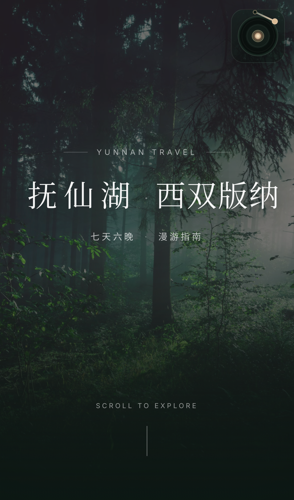
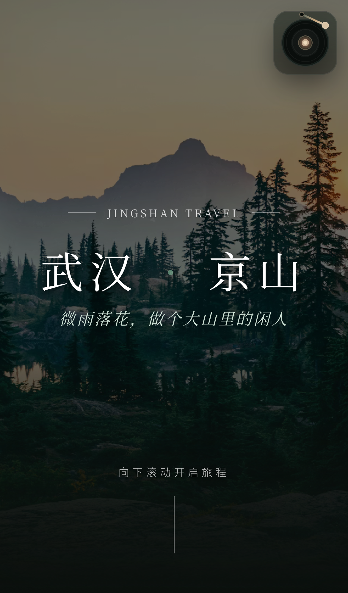
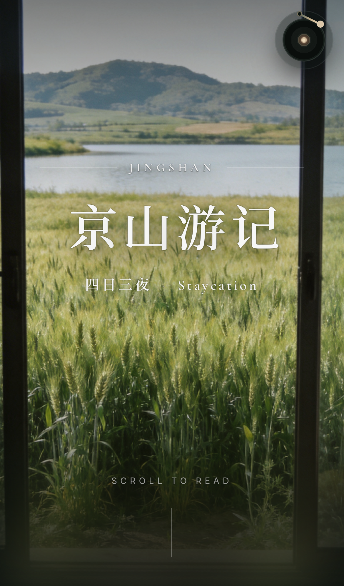
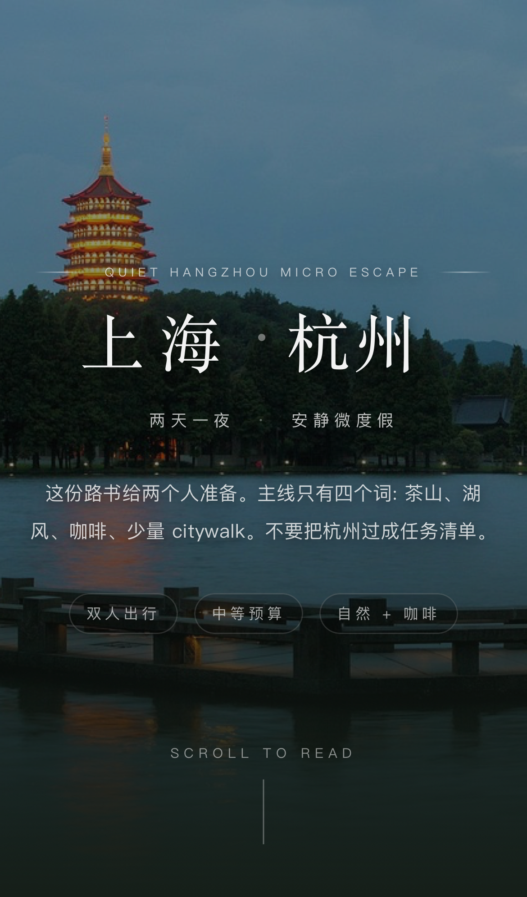

# Dark Luxury Editorial Web Skill

> Turn raw travel text into a cinematic editorial microsite.  
> 把一份旅行原始文案，做成真正有氛围、有结构、有呼吸感的网页。

If your current “travel guide” is a pile of notes, a few screenshots, and a brave heart, this skill is here to help.  
如果你现在手里的“旅行攻略”还是一堆零散笔记、几张截图，再加一点硬撑着的审美，这个 skill 就是来救场的。

It is built for dark editorial travel pages that should feel restrained, visual, and actually worth sharing.  
它专门服务于那种暗调杂志风旅行网页：克制、沉浸、摄影主导，而且真的适合发给别人看。

## Why This Skill Exists / 这个 Skill 到底是干嘛的？

This is a reusable Codex skill for turning:

- travel briefs
- multi-day route guides
- first-person travel notes
- loose destination ideas

into:

- editorial landing pages
- route-guide microsites
- first-person travel memoir websites
- mobile-first dark luxury travel experiences

这个 skill 的目标不是“把字放到网页上”。  
它的目标是把下面这些东西：

- 路书草稿
- 多天行程攻略
- 第一人称游记
- 还没成型的旅行意图

变成下面这些真正能打的东西：

- 有封面感的 travel landing page
- 可交互的路书 microsite
- 第一人称旅行游记网页
- 移动端优先的暗调高级感旅行体验

## What Makes It Useful / 它的卖点在哪里？

Not “another dark page with some text on it.”  
不是“再做一个黑底白字的网页”。

This skill is opinionated in the places that usually go wrong:

- Hero and second-screen continuity
- cover image reused as the blurred world beneath the page
- place / food tags with real semantic constraints
- route-guide vs memoir content structuring
- mobile optical centering instead of desktop-first leftovers
- media sourcing with fallback rules instead of wishful thinking
- audio workflow guidance when the page needs BGM
- font payload control so the page does not secretly become a truck full of CJK font files

它会重点管住那些最容易翻车的地方：

- 首屏和次页不能像两块硬拼的板子
- 同一张封面图要同时承担清晰 Hero 和底层模糊背景
- tag 不是乱打词，只能是具体地点或食物
- 路书和游记的结构逻辑要分开处理
- 移动端不是“桌面版缩小一下”
- 素材 sourcing 不能只会死磕一个网站
- 有 BGM 时，交互和真实播放状态要一致
- 字体不能一上来就把构建体积炸穿

## Real Outputs / 真实产出

These are real project outputs from the benchmark family and cold-start validation flow.  
下面这些都是这套 skill 真实跑出来、或者用于校准这套 skill 的项目效果，不是临时拼出来的展示图。

<table>
  <tr>
    <td align="center">
      <a href="https://dark-luxury-travel-itinerary.vercel.app">
        
      </a>
      <br />
      <strong>Xishuangbanna Route Guide</strong>
      <br />
      抚仙湖 · 西双版纳路书
    </td>
    <td align="center">
      <a href="https://wuhan-jingshan-travel-guide.vercel.app">
        
      </a>
      <br />
      <strong>Jingshan Route Guide</strong>
      <br />
      武汉 · 京山路书
    </td>
  </tr>
  <tr>
    <td align="center">
      <a href="https://youji.travel-itinerary-jingshan.online">
        
      </a>
      <br />
      <strong>Jingshan Memoir</strong>
      <br />
      京山四日三夜游记
    </td>
    <td align="center">
      <a href="https://skill-solid-coldstart-routeguide-ag.vercel.app">
        
      </a>
      <br />
      <strong>Cold-start Validation</strong>
      <br />
      从 0 到 1 的杭州两天一夜测试站
    </td>
  </tr>
</table>

## What Is Included / 仓库里有什么

- `dark-luxury-editorial-web-skill/`
  Full skill source.
  完整 skill 源码目录。

- `dark-luxury-editorial-web-skill/SKILL.md`
  Core workflow, non-negotiables, visual system, and QA rules.
  核心工作流、硬规则、视觉系统与 QA 规范。

- `dark-luxury-editorial-web-skill/references/`
  Supporting references for benchmarking, itinerary planning, writing tone, implementation recipes, and media sourcing.
  配套参考文档，涵盖 benchmark、行程规划、文风约束、实现配方和媒体素材工作流。

- `dist/dark-luxury-editorial-web-skill.skill`
  Packaged installable artifact.
  打包好的可安装 `.skill` 文件。

## Key Capabilities / 核心能力

- Hero and next-screen transition rules  
  首屏与次页过渡规则

- Route-guide and memoir structuring  
  路书 / 游记双内容模式结构化

- Cold-start itinerary generation flow  
  从旅行意图到完整路书的冷启动流程

- Place / food tag semantics  
  地点 / 食物 tag 语义约束

- Media sourcing with fallback chain  
  带 fallback 的素材 sourcing 工作流

- Audio direction and playback UX guidance  
  音乐方向选择与播放器交互指导

- Font payload control for Vite travel projects  
  面向 Vite 旅行站点的字体体积控制

## Benchmark Family / 校准项目族

This skill is calibrated against these live projects:

- Xishuangbanna route guide: `https://dark-luxury-travel-itinerary.vercel.app`
- Jingshan route guide: `https://wuhan-jingshan-travel-guide.vercel.app`
- Jingshan memoir: `https://youji.travel-itinerary-jingshan.online`

这意味着它追求的不是“普通好看”，而是尽量属于同一个项目家族：  
摄影主导、深绿黑底、Hero 和次页连成一个世界、细节克制但不寡淡。

## Install Artifact / 安装文件

The packaged artifact lives here:

- `dist/dark-luxury-editorial-web-skill.skill`

如果你只想安装，不想自己整理源目录，直接拿这个文件就行。

## Repository Structure / 仓库结构

```text
.
├── assets/
│   └── screenshots/
├── dark-luxury-editorial-web-skill/
│   ├── SKILL.md
│   ├── agents/
│   └── references/
└── dist/
    └── dark-luxury-editorial-web-skill.skill
```

## Version / 版本

Current public release:

- `v1.0.0`

当前公开版本：

- `v1.0.0`

## In One Sentence / 一句话总结

This skill helps you stop shipping “some text on a dark background” and start shipping travel pages that actually feel like a place.  
这个 skill 会帮你停止生产“黑底上摆几段字”的旅行网页，开始认真做出“像一个地方”的旅行网页。
